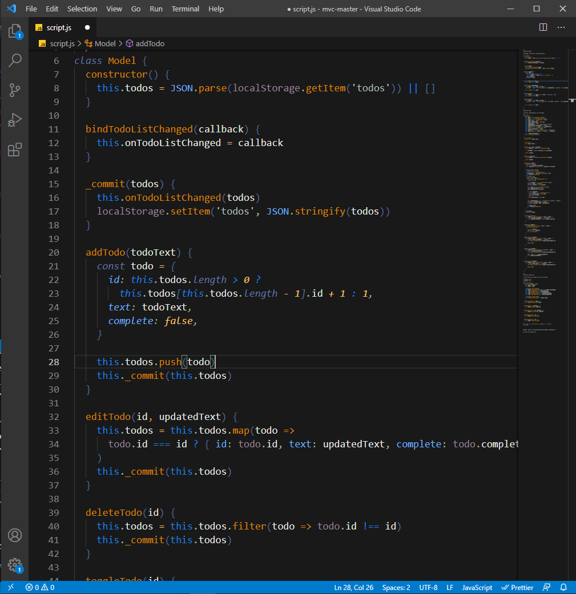
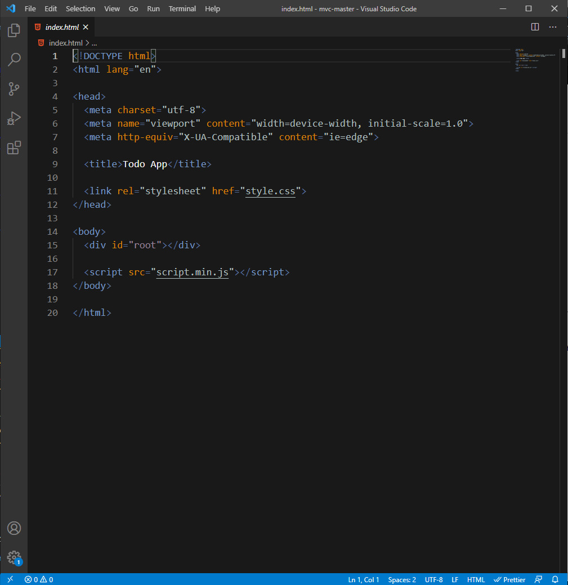
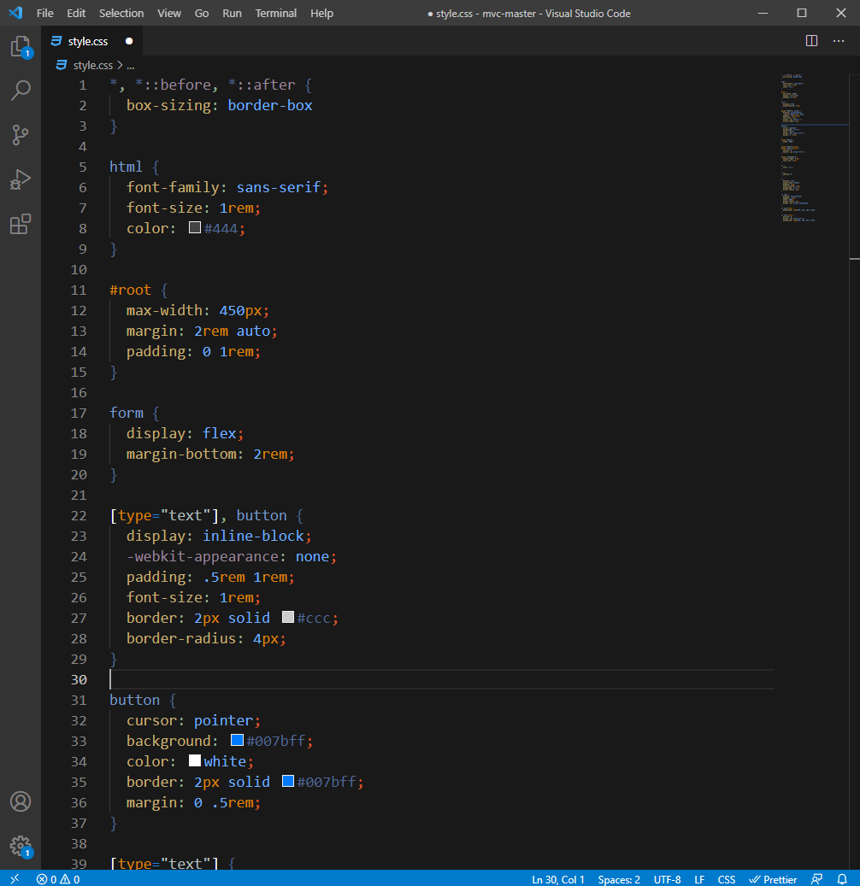
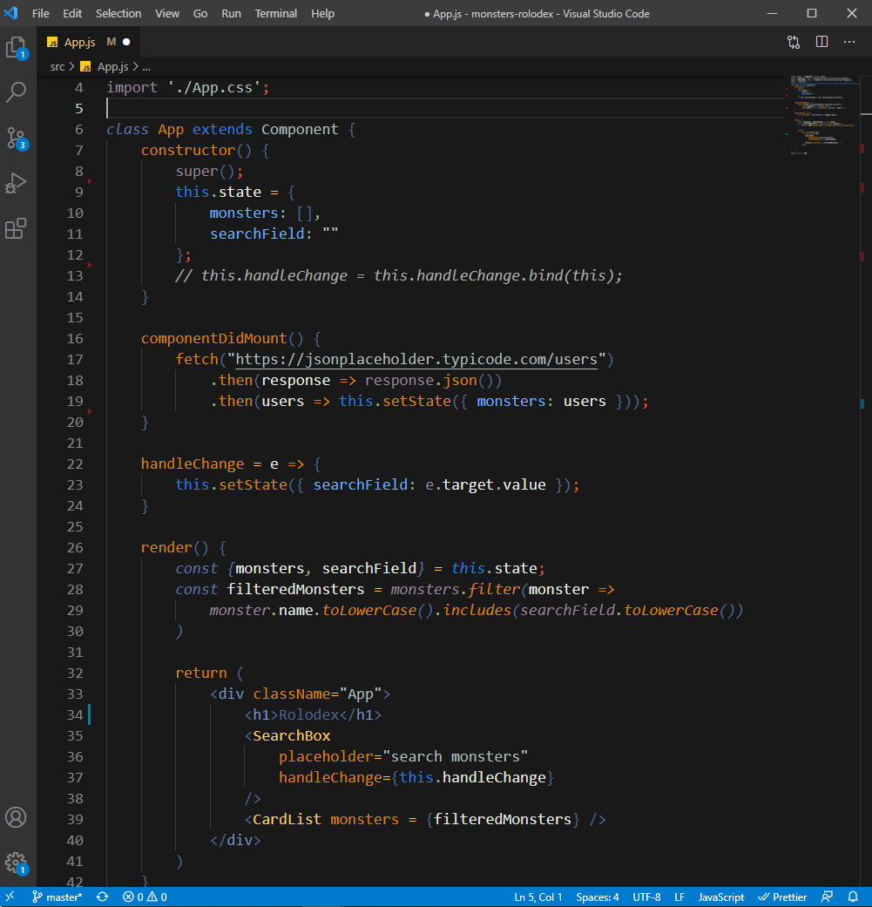
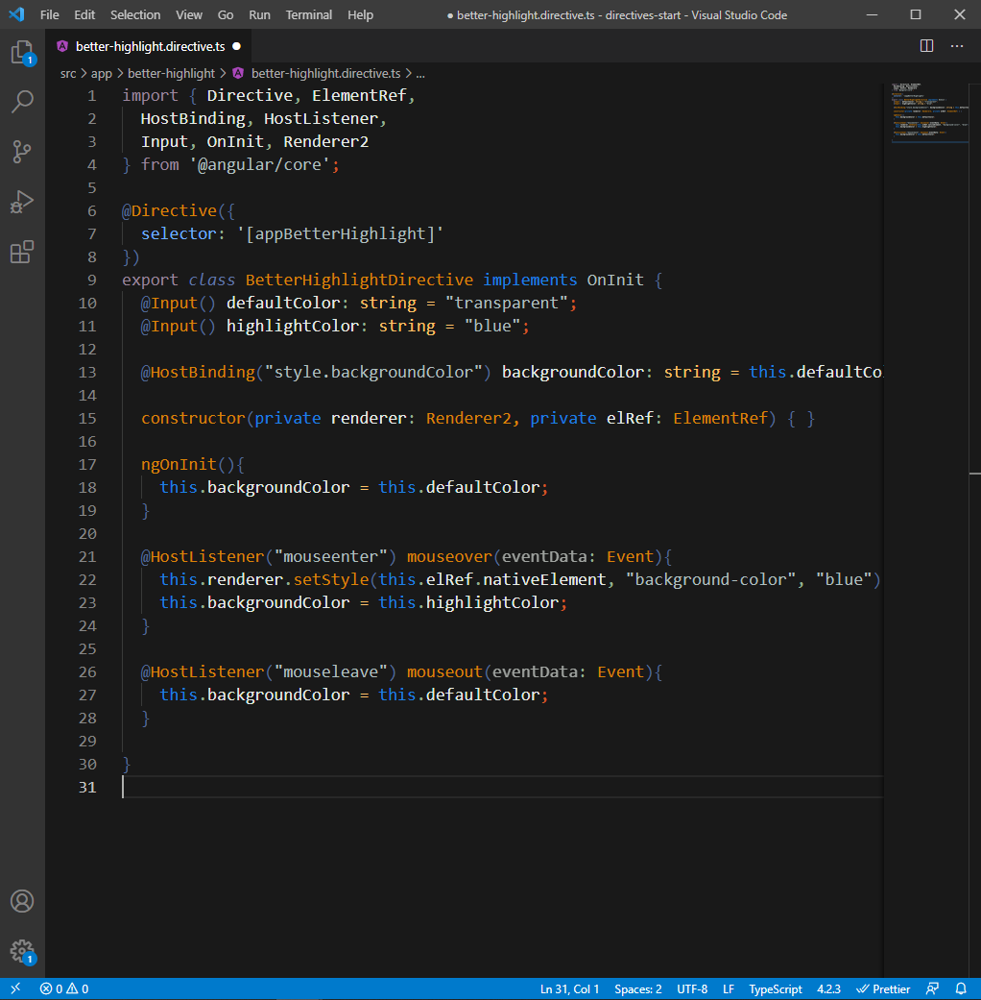
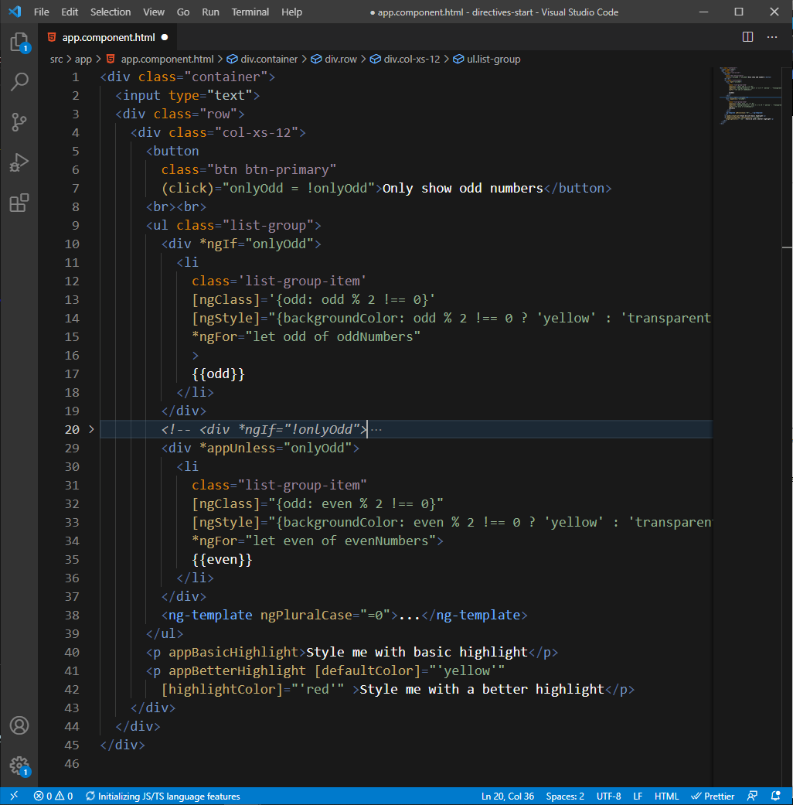

# README
## Vanguard Color Theme for VS Code
This is a very unsaturated (mostly) color scheme, its based on the color scheme for Destiny 2's Vanguard.

I was looking for a change of colors on my IDE and found that the vanguard colors where a nice fit on a black background, hope some of you will enjoy it too.

As I will be working on it further as I use and learn new languages, if you like it and you would like to help you can fork this theme and update it with me at https://github.com/Martin-Alvarado-A/vanguard.

### Supported languages
* Javascript
* Typescript
* CSS/SCSS
* HTML

### Preview

**Enjoy!**
